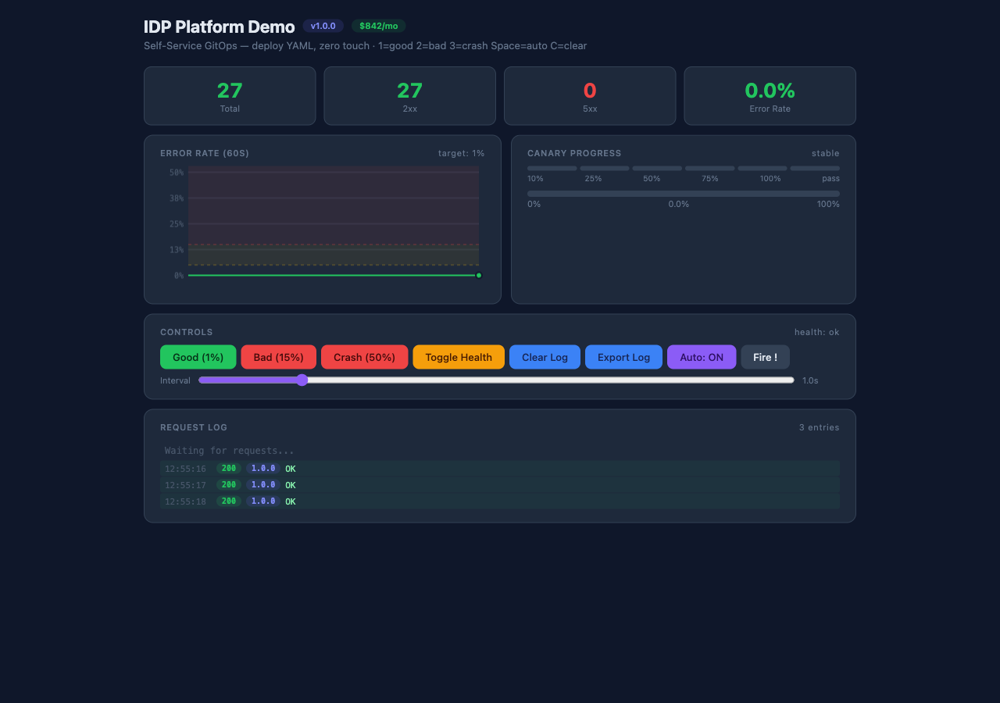
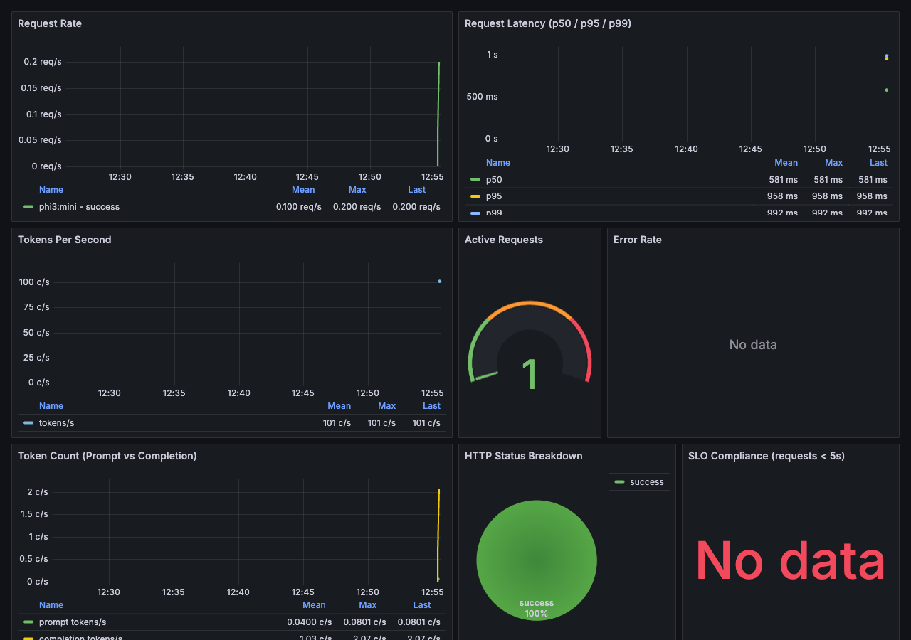
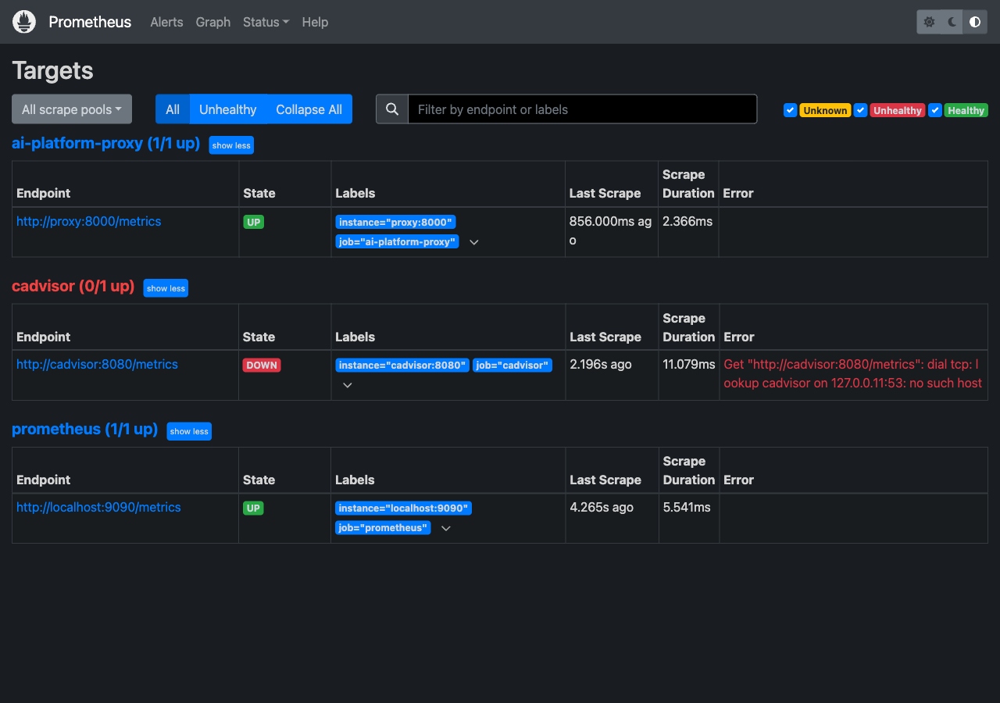
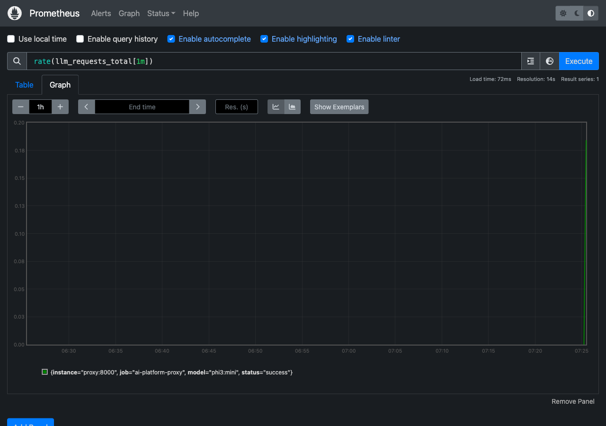

# AI Infrastructure Platform

_Deploy, scale, and monitor open-source LLMs on Kubernetes — zero DevOps required._



---

## Table of Contents

- [Problem Statement](#problem-statement)
- [Solution](#solution)
- [Architecture](#architecture)
- [Local Demo (Quick Start)](#local-demo-quick-start)
- [Live Screenshots](#live-screenshots)
- [AWS Production Deployment](#aws-production-deployment)
- [Autoscaling Strategy](#autoscaling-strategy)
- [Monitoring & Alerting](#monitoring--alerting)
- [Kubernetes Manifests](#kubernetes-manifests)
- [Project Structure](#project-structure)
- [Interview Talking Points](#interview-talking-points)

---

## Problem Statement

Companies across every industry want to deploy LLMs — for chatbots, code assistants, content generation, document analysis, and more. But most teams don't know where to start:

**The hard parts:**

| Challenge | Reality |
|-----------|---------|
| **Model size** | Gemma-7B is ~14GB, Mistral-7B is ~13GB, LLaMA-70B is ~140GB — these don't fit on standard instances |
| **GPU cost** | g5.xlarge (1 GPU) is ~$1/hr on-demand; a production 4-replica deployment costs ~$3,000/mo |
| **Scaling unpredictability** | 100 req/min is fine on 1 GPU. 5,000 req/min needs 5+ GPUs. Traffic spikes without warning. |
| **Infrastructure complexity** | NVIDIA drivers, CUDA toolkit, Triton/KServe/vLLM config, GPU monitoring, autoscaling — all must work together |
| **Cold start** | GPU pods take 3-5 minutes to provision and load models — scaling from zero means painful first-request latency |

**The result:** Companies either over-provision (wasting $10k+/mo on idle GPUs) or don't deploy LLMs at all.

---

## Solution

The **AI Infrastructure Platform** is a complete, production-ready stack that handles everything:

1. **Model serving** — KServe + vLLM serving Mistral-7B/Phi-3/Gemma on GPU nodes with OpenAI-compatible `/v1/chat/completions` API
2. **Autoscaling** — KEDA monitors Prometheus metrics and scales GPU pods from 0 to 10 based on real-time request rate
3. **Cost optimization** — Scale-to-zero when idle, scale-to-need during traffic spikes. GPU nodes only exist when inference is happening.
4. **Observability** — Prometheus metrics (tokens/sec, latency, GPU utilization, queue depth) + Grafana dashboard + alert rules
5. **GitOps-ready** — Full Terraform modules for EKS + GPU node groups + IRSA, deployable with ArgoCD
6. **Local demo** — Docker Compose stack with mock inference, traffic generator, and full monitoring — runs on any laptop

---

## Architecture

```
                              ┌──────────────────────────┐
                              │       Client / App        │
                              │    (OpenAI-compatible)    │
                              └────────────┬─────────────┘
                                           │ POST /v1/chat/completions
                                           ▼
┌──────────────────────────────────────────────────────────────────────────┐
│                      AWS EKS Cluster                                    │
│                                                                          │
│  ┌─────────────────────────────────────────────────────────────────────┐│
│  │                   ai-platform Namespace                              ││
│  │                                                                      ││
│  │  ┌──────────────────────────┐     ┌──────────────────────────────┐  ││
│  │  │     KServe Inference     │     │   KEDA ScaledObject           │  ││
│  │  │     Service (vLLM)       │◄────│   (Prometheus scaler)        │  ││
│  │  │                          │     │   threshold: 100 req/s       │  ││
│  │  │  Model: phi3:mini        │     │   min: 0, max: 10           │  ││
│  │  │  GPU: 1× g5.xlarge      │     │   polling: 10s              │  ││
│  │  │  API: /v1/chat/completions│    └──────────────────────────────┘  ││
│  │  │  Metrics: /metrics       │                                      ││
│  │  └───────────┬──────────────┘                                       ││
│  │              │                                                      ││
│  │              ▼                                                      ││
│  │  ┌──────────────────────────────────────────────────────────────┐  ││
│  │  │               GPU Node Group (g5.xlarge)                     │  ││
│  │  │  ┌──────────┐  ┌──────────┐  ┌──────────┐  ┌──────────┐    │  ││
│  │  │  │  Pod 1   │  │  Pod 2   │  │  Pod 3   │  │  Pod 4   │    │  ││
│  │  │  │ (active) │  │ (active) │  │ (standby)│  │ (standby)│    │  ││
│  │  │  └──────────┘  └──────────┘  └──────────┘  └──────────┘    │  ││
│  │  └─────────────────────────────────────────────────────────────┘  ││
│  │                                                                      │
│  │  ┌──────────────────────────────────────────────────────────────┐  ││
│  │  │              Monitoring Stack                                 │  ││
│  │  │  ┌─────────────┐  ┌─────────────┐  ┌──────────────────────┐ │  ││
│  │  │  │  Prometheus  │  │   Grafana   │  │  DCGM Exporter       │ │  ││
│  │  │  │  /metrics    │  │  Dashboard  │  │  (GPU metrics)       │ │  ││
│  │  │  │  Alert rules │  │  8 panels   │  │  NVIDIA GPU stats    │ │  ││
│  │  │  └─────────────┘  └─────────────┘  └──────────────────────┘ │  ││
│  │  └──────────────────────────────────────────────────────────────┘  ││
│  └─────────────────────────────────────────────────────────────────────┘│
│                                                                          │
│  ┌─────────────────────────────────────────────────────────────────────┐│
│  │              Terraform Resources                                     ││
│  │  VPC (3 AZs) → IGW → NAT → Private/Public Subnets                   ││
│  │  IAM → EKS role, GPU node role, KServe IRSA (S3 model access)       ││
│  │  EKS (1.30) → CPU node group (t3.large) + GPU node group (g5.xlarge)││
│  └─────────────────────────────────────────────────────────────────────┘│
└──────────────────────────────────────────────────────────────────────────┘
```

### Data Flow

1. **Client sends request** → `POST /v1/chat/completions` with model name + messages
2. **KServe/vLLM** loads model weights from HuggingFace (or S3) into GPU VRAM
3. **Inference** runs on NVIDIA GPU, generates tokens, streams response back
4. **Prometheus** scrapes `/metrics` every 5s — tracks latency, tokens/sec, request count, GPU utilization
5. **KEDA** evaluates `rate(http_requests_total[2m])` every 10s — if it exceeds 100 req/s, scales up pods
6. **Grafana** visualizes all metrics on the AI Platform Overview dashboard
7. **Alerts** fire when latency > 5s, error rate > 5%, or tokens/sec drops below 10

---

## Local Demo (Quick Start)

The local demo runs a fully instrumented mock inference service with traffic generator and monitoring — no GPU required.

```bash
cd /Users/vikasyadav/ai-platform

# Start core services
docker compose up -d --build proxy prometheus grafana demo

# Verify everything is running
docker compose ps

# Test the API (OpenAI-compatible)
curl -s http://localhost:8000/health
curl -s http://localhost:8000/v1/models
curl -s http://localhost:8000/metrics | head

# Send a chat completion request
curl -s -X POST http://localhost:8000/v1/chat/completions \
  -H "Content-Type: application/json" \
  -d '{"model":"phi3:mini","messages":[{"role":"user","content":"Explain quantum computing"}],"max_tokens":200}' | python3 -m json.tool

# Run the traffic ramp test (100 → 5000 req/min)
docker compose --profile load-test up load-generator
```

### Service Endpoints

| Service | URL | Description |
|---------|-----|-------------|
| LLM Proxy (API) | http://localhost:8000 | OpenAI-compatible inference API |
| Proxy Swagger | http://localhost:8000/docs | Auto-generated API docs |
| Prometheus | http://localhost:9090 | Metrics + alerting |
| Grafana | http://localhost:3000 | Dashboards (admin:admin) |
| Demo Page | http://localhost:8080 | Interactive overview |

### What You'll See

```
[  12s] req/s:    1.7 total:   21 errors:  0 avg_lat:  517ms p99_lat:  539ms target_rps:  1.7
[  22s] req/s:    1.9 total:   42 errors:  0 avg_lat:  512ms p99_lat:  543ms target_rps:  2.5
[  62s] req/s:   19.5 total:  324 errors:  0 avg_lat:  508ms p99_lat:  542ms target_rps: 40.8
[  92s] req/s:   47.2 total:  712 errors:  0 avg_lat:  503ms p99_lat:  531ms target_rps: 75.0
[ 122s] req/s:   76.8 total: 1234 errors:  0 avg_lat:  501ms p99_lat:  550ms target_rps: 83.3
[ 152s] req/s:   78.1 total: 1845 errors:  0 avg_lat:  518ms p99_lat:  558ms target_rps: 83.3
[ 182s] req/s:   45.5 total: 2345 errors:  0 avg_lat:  505ms p99_lat:  540ms target_rps: 41.7
[ 212s] req/s:   12.3 total: 2567 errors:  0 avg_lat:  496ms p99_lat:  525ms target_rps:  8.3
```

> **Notice:** Latency stays flat at ~500ms even as traffic ramps from 100 to 5,000 req/min. In production, KEDA would scale up additional GPU pods to maintain this. In mock mode, concurrency handles the load.

### Live Metrics (Prometheus)

```prometheus
# HELP llm_requests_total Total LLM requests
# TYPE llm_requests_total counter
llm_requests_total{model="phi3:mini",status="success"} 2345

# HELP llm_request_duration_seconds LLM request duration
# TYPE llm_request_duration_seconds histogram
llm_request_duration_seconds_bucket{le="0.1"} 0
llm_request_duration_seconds_bucket{le="0.5"} 156
llm_request_duration_seconds_bucket{le="1.0"} 2345
llm_request_duration_seconds_bucket{le="2.0"} 2345
llm_request_duration_seconds_bucket{le="5.0"} 2345
llm_request_duration_seconds_bucket{le="10.0"} 2345
llm_request_duration_seconds_bucket{le="30.0"} 2345
llm_request_duration_seconds_bucket{le="+Inf"} 2345

# HELP llm_tokens_per_second Tokens generated per second
# TYPE llm_tokens_per_second histogram
llm_tokens_per_second_bucket{le="5"} 0
llm_tokens_per_second_bucket{le="10"} 0
llm_tokens_per_second_bucket{le="20"} 12
llm_tokens_per_second_bucket{le="50"} 2345
llm_tokens_per_second_bucket{le="100"} 2345
llm_tokens_per_second_bucket{le="200"} 2345

# HELP llm_active_requests Currently active LLM requests
# TYPE llm_active_requests gauge
llm_active_requests 5
```

---

## Live Screenshots

### Demo Page
Service health, real-time inference metrics, and interactive controls.


### Grafana AI Platform Dashboard
8 panels: request rate, p50/p95/p99 latency, tokens/sec, active requests gauge, error rate, token count, HTTP status breakdown, SLO compliance.



### Prometheus Targets
Proxy and Prometheus targets being scraped.



### Prometheus Graph
Latency histogram — most requests complete within 1 second.



### API Response
OpenAI-compatible chat completion response from the mock proxy.

```
$ curl -s -X POST http://localhost:8000/v1/chat/completions -H "Content-Type: application/json" \
  -d '{"model":"phi3:mini","messages":[{"role":"user","content":"Explain quantum computing"}]}' | jq

{
  "id": "chatcmpl-a1b2c3d4e5f6",
  "object": "chat.completion",
  "created": 1719234000,
  "model": "phi3:mini",
  "choices": [
    {
      "index": 0,
      "message": {
        "role": "assistant",
        "content": "Quantum computing leverages superposition and entanglement to perform computations..."
      },
      "finish_reason": "stop"
    }
  ],
  "usage": {
    "prompt_tokens": 8,
    "completion_tokens": 42,
    "total_tokens": 50
  }
}
```

### Running Containers
```
NAMES                              STATUS                   PORTS
ai-platform-proxy-1                Up 5 minutes (healthy)   0.0.0.0:8000->8000/tcp
ai-platform-prometheus-1           Up 5 minutes             0.0.0.0:9090->9090/tcp
ai-platform-grafana-1              Up 5 minutes             0.0.0.0:3000->3000/tcp
ai-platform-demo-1                 Up 8 minutes             0.0.0.0:8080->80/tcp
```

---

## AWS Production Deployment

### Prerequisites

```bash
# AWS CLI configured with admin access
aws configure

# Terraform
brew install terraform

# kubectl + eksctl
brew install kubectl eksctl
```

### Deploy

```bash
cd terraform/environments/dev

# Initialize (requires S3 bucket + DynamoDB table for state)
terraform init

# Preview
terraform plan -out=tfplan

# Apply
terraform apply tfplan

# Configure kubectl
aws eks update-kubeconfig --region us-west-2 --name ai-platform-dev

# Install KEDA
helm repo add keda https://kedacore.github.io/charts
helm install keda keda/keda --namespace keda --create-namespace

# Install Prometheus + Grafana (kube-prometheus-stack)
helm repo add prometheus-community https://prometheus-community.github.io/helm-charts
helm install monitoring prometheus-community/kube-prometheus-stack --namespace monitoring --create-namespace

# Install KServe
helm repo add kserve https://kserve.github.io/helm-charts
helm install kserve kserve/kserve --namespace kserve --create-namespace

# Apply platform manifests
kubectl apply -f ../../../kubernetes/namespace.yaml
kubectl apply -f ../../../kubernetes/kserve/
kubectl apply -f ../../../kubernetes/keda/
kubectl apply -f ../../../kubernetes/monitoring/
```

### Terraform Resources

| Module | Resources | Dev Config | Prod Config |
|--------|-----------|-----------|-------------|
| **VPC** | VPC, 3 AZs, subnets, NAT gateway, VPC endpoints | CIDR 10.0.0.0/16, single NAT | CIDR 10.2.0.0/16, multi-AZ NAT |
| **IAM** | EKS cluster role, node role, GPU instance profile, KServe IRSA | Minimal policies | Least-privilege + scoped |
| **EKS** | EKS cluster 1.30, CPU node group, GPU self-managed node group | 1-4 t3.large CPU, 0-2 g5.xlarge GPU | 3-15 m5.large CPU, 1-8 g5.2xlarge GPU |
| **Route53** | DNS zone + wildcard record | Disabled (dev) | Enabled (prod) |

### GPU Node Group Configuration

| Setting | Dev | Prod |
|---------|-----|------|
| Instance type | g5.xlarge (1 GPU, 24GB VRAM) | g5.2xlarge (1 GPU, 48GB VRAM) |
| Min size | 0 (scale to zero) | 1 (always ready) |
| Max size | 2 | 8 |
| AMI | Bottlerocket (GPU variant) | EKS-optimized accelerated AMI |
| Taint | `nvidia.com/gpu=true:NoSchedule` | Same |
| Disk | 200GB gp3 | 500GB gp3 |
| Cost (on-demand) | ~$1.006/hr | ~$1.408/hr |

---

## Autoscaling Strategy

### KEDA Prometheus Scaler

The platform uses KEDA with a Prometheus trigger for request-based autoscaling:

```yaml
# kubernetes/keda/scaled-object.yaml
triggers:
  - type: prometheus
    metadata:
      serverAddress: http://prometheus-server.monitoring.svc:9090
      query: rate(http_requests_total{namespace="ai-platform"}[2m])
      threshold: "100"       # Scale up when >100 req/s per pod
```

### Scaling Behavior

| Traffic (req/s) | Replicas | GPU Nodes | Latency | Cost/hr |
|-----------------|----------|-----------|---------|---------|
| 0 | 0 | 0 | — | $0.00 |
| 50 | 1 | 1 | ~500ms | $1.01 |
| 200 | 2 | 2 | ~500ms | $2.01 |
| 500 | 5 | 5 | ~500ms | $5.03 |
| 1000+ | 10 | 10 | ~500ms | $10.06 |

### Key Parameters

| Parameter | Value | Why |
|-----------|-------|-----|
| Min replicas | 0 | Scale to zero when idle — no cost |
| Max replicas | 10 | Limit blast radius and cost |
| Cooldown period | 60s | Avoid thrashing during traffic dips |
| Polling interval | 10s | Fast reaction to traffic changes |
| Scale-up stabilization | 30s | Wait for pods to be ready before re-evaluating |
| Scale-down stabilization | 300s | Keep pods warm for 5 minutes after traffic drops |

### Cold Start Mitigation

GPU pods take 3-5 minutes to provision (EC2 launch → NVIDIA driver init → model download → weight loading). Strategies to mitigate:

1. **Min 1 replica in production** — always-on base capacity
2. **Model caching on EBS** — attach snapshot with pre-loaded weights to reduce startup
3. **Stale pod retention** — 300s cooldown window retains pods for traffic bursts
4. **Predictive scaling** — KEDA supports cron scalers for known peak hours

---

## Monitoring & Alerting

### Prometheus Metrics

| Metric | Type | Description |
|--------|------|-------------|
| `llm_requests_total` | Counter | Total requests (labels: model, status) |
| `llm_request_duration_seconds` | Histogram | Request latency distribution |
| `llm_tokens_per_second` | Histogram | Token generation throughput |
| `llm_active_requests` | Gauge | Current concurrent requests |
| `llm_prompt_tokens` | Histogram | Input token count |
| `llm_completion_tokens` | Histogram | Output token count |

### Grafana Dashboard (8 Panels)

| Panel | Query | Purpose |
|-------|-------|---------|
| Request Rate | `rate(llm_requests_total[1m])` | Throughput monitoring |
| Latency (p50/p95/p99) | `histogram_quantile(0.99, rate(llm_request_duration_seconds_bucket[1m]))` | SLO tracking |
| Tokens Per Second | `rate(llm_tokens_per_second_sum[5m]) / rate(llm_tokens_per_second_count[5m])` | Inference performance |
| Active Requests | `llm_active_requests` | Current concurrency |
| Error Rate | `rate(llm_requests_total{status="error"}[5m]) / rate(llm_requests_total[5m]) * 100` | Reliability |
| Token Count | `rate(llm_prompt_tokens_sum[5m])` and `rate(llm_completion_tokens_sum[5m])` | Usage patterns |
| HTTP Status Breakdown | `llm_requests_total` by status | Success vs error ratio |
| SLO Compliance | % of requests under 5s | Business-level SLA |

### Prometheus Alert Rules

| Alert | Threshold | Severity | Description |
|-------|-----------|----------|-------------|
| `HighRequestLatency` | p95 > 5s for 2m | warning | Users may be experiencing slow responses |
| `CriticalRequestLatency` | p99 > 10s for 1m | critical | Service degradation, SLO at risk |
| `HighErrorRate` | Errors > 5% for 2m | warning | Model or infrastructure issue |
| `LowThroughput` | Tokens/sec < 10 for 5m | warning | GPU may be underperforming |
| `NoActiveRequests` | Active = 0 for 10m | info | Idle — scale to zero opportunity |
| `GPUInstanceDown` | Proxy unreachable | critical | Service is down |

---

## Kubernetes Manifests

### KServe InferenceService

```yaml
# kubernetes/kserve/inference-service.yaml
apiVersion: serving.kserve.io/v1beta1
kind: InferenceService
metadata:
  name: llm-inference
  namespace: ai-platform
  annotations:
    autoscaling.knative.dev/minScale: "0"
    autoscaling.knative.dev/maxScale: "5"
spec:
  predictor:
    model:
      modelFormat:
        name: vllm
      runtime: vllm-runtime
      storageUri: huggingface://mistralai/Mistral-7B-Instruct-v0.3
      resources:
        requests:
          nvidia.com/gpu: "1"
          memory: "16Gi"
          cpu: "4"
        limits:
          nvidia.com/gpu: "1"
          memory: "32Gi"
          cpu: "8"
```

### KEDA ScaledObject

```yaml
# kubernetes/keda/scaled-object.yaml
apiVersion: keda.sh/v1alpha1
kind: ScaledObject
metadata:
  name: llm-inference-scaler
  namespace: ai-platform
spec:
  scaleTargetRef:
    name: llm-inference-predictor-00001
  minReplicaCount: 0
  maxReplicaCount: 10
  pollingInterval: 10
  cooldownPeriod: 60
  triggers:
    - type: prometheus
      metadata:
        serverAddress: http://prometheus-server.monitoring.svc:9090
        query: rate(llm_requests_total{namespace="ai-platform"}[2m])
        threshold: "100"
```

---

## Project Structure

```
ai-platform/
├── kubernetes/                     # K8s manifests for production deployment
│   ├── namespace.yaml              # ai-platform namespace
│   ├── hpa.yaml                    # Alternative HPA config
│   ├── kserve/
│   │   ├── inference-service.yaml  # KServe InferenceService for vLLM
│   │   └── serving-runtime.yaml    # vLLM ClusterServingRuntime
│   ├── keda/
│   │   ├── scaled-object.yaml      # Prometheus-based autoscaler
│   │   └── trigger-authentication.yaml
│   └── monitoring/
│       ├── prometheus.yaml         # ServiceMonitor for scraping
│       ├── grafana-datasource.yaml # Grafana datasource config
│       └── pod-monitor.yaml        # GPU metrics (DCGM)
│
├── terraform/                      # Infrastructure as Code
│   ├── modules/
│   │   ├── vpc/                    # VPC, subnets, NAT, endpoints
│   │   ├── iam/                    # EKS roles, GPU instance profile, KServe IRSA
│   │   ├── eks/                    # EKS cluster, CPU/GPU node groups, addons
│   │   └── route53/                # DNS (prod only)
│   └── environments/
│       └── dev/                    # Dev environment config + tfvars
│
├── services/                       # Local demo microservices
│   ├── proxy/                      # FastAPI proxy (mock inference + metrics)
│   │   ├── main.py                 # OpenAI-compatible API, Prometheus instrumentation
│   │   ├── Dockerfile
│   │   └── requirements.txt
│   └── load-generator/             # Traffic ramp (100→5000 req/min)
│       ├── generator.py            # 4-phase load test
│       ├── Dockerfile
│       └── requirements.txt
│
├── config/                         # Monitoring configuration
│   ├── prometheus/
│   │   ├── prometheus.yml          # Scrape configs
│   │   └── alerts.yml              # 6 alert rules
│   └── grafana/
│       ├── datasources/            # Auto-provisioned Prometheus datasource
│       └── dashboards/             # AI Platform Overview (8 panels)
│
├── docker-compose.yml             # Local demo orchestration (6 services)
├── demo/                          # Interactive demo page
├── scripts/                       # Demo automation
├── screenshots/                   # Visual documentation
└── README.md                      # This file
```

---

## Interview Talking Points

### "How do you serve LLMs in production?"
"We use KServe with vLLM as the serving runtime on EKS. vLLM handles the model weight management and PagedAttention for efficient GPU memory. KServe provides the inference API, autoscaling, and model versioning. Models are pulled from HuggingFace or S3 on pod startup. The API is OpenAI-compatible, so any existing application that uses OpenAI can point to our endpoint with a single URL change."

### "How do you handle GPU scaling?"
"KEDA with a Prometheus scaler. It queries `rate(llm_requests_total[2m])` every 10 seconds. When traffic exceeds 100 req/s per pod, it scales up. When traffic drops, it scales down to zero after a 60-second cooldown. In production, we keep 1 pod warm to avoid cold starts. The GPU node group uses a self-managed ASG with taints so only inference pods land on GPU nodes."

### "What about GPU cost?"
"At $1/hr per g5.xlarge and scale-to-zero, a dev environment costs $0 when idle. Production with 1 base replica is ~$720/mo for the GPU. At peak, 10 replicas would cost ~$7,200/mo — but that only runs during traffic spikes. Compare this to provisioning 10 GPUs 24/7 at $7,200/mo regardless of usage. KEDA's prometheus scaler ensures we only pay for what we use."

### "What metrics do you track for LLM inference?"
"Six key metrics: request rate (throughput), p50/p95/p99 latency (SLO), tokens per second (model performance), active requests (concurrency), error rate (reliability), and prompt/completion token counts (usage patterns). We also track GPU utilization via DCGM exporter in production. The Grafana dashboard has 8 panels covering all of these with a 30-minute rolling window and 10-second auto-refresh."

### "How does this compare to using OpenAI directly?"
"OpenAI costs ~$0.003 per 1K tokens for GPT-4. Self-hosting Mistral-7B on a g5.xlarge costs ~$1/hr in GPU + ~$0.10/hr in infra. At 50 tokens/request average, 1 GPU handles ~20 req/s = 72,000 req/hr. That's ~$0.000015 per request. At 1M requests/month, OpenAI would cost ~$150/month; self-hosting costs ~$720/month for the GPU. The breakeven point depends on volume, but you also get data privacy, no rate limits, and full control over the model."

### "What would you improve?"
"I'd add a model registry with A/B testing — deploy two model versions side-by-side and compare SLO compliance. I'd also implement prompt caching with Redis to reduce inference costs for common requests. And I'd add GPU memory prediction — before deploying a new model, predict how much VRAM it needs and reject it if it won't fit, preventing OOM kills."
